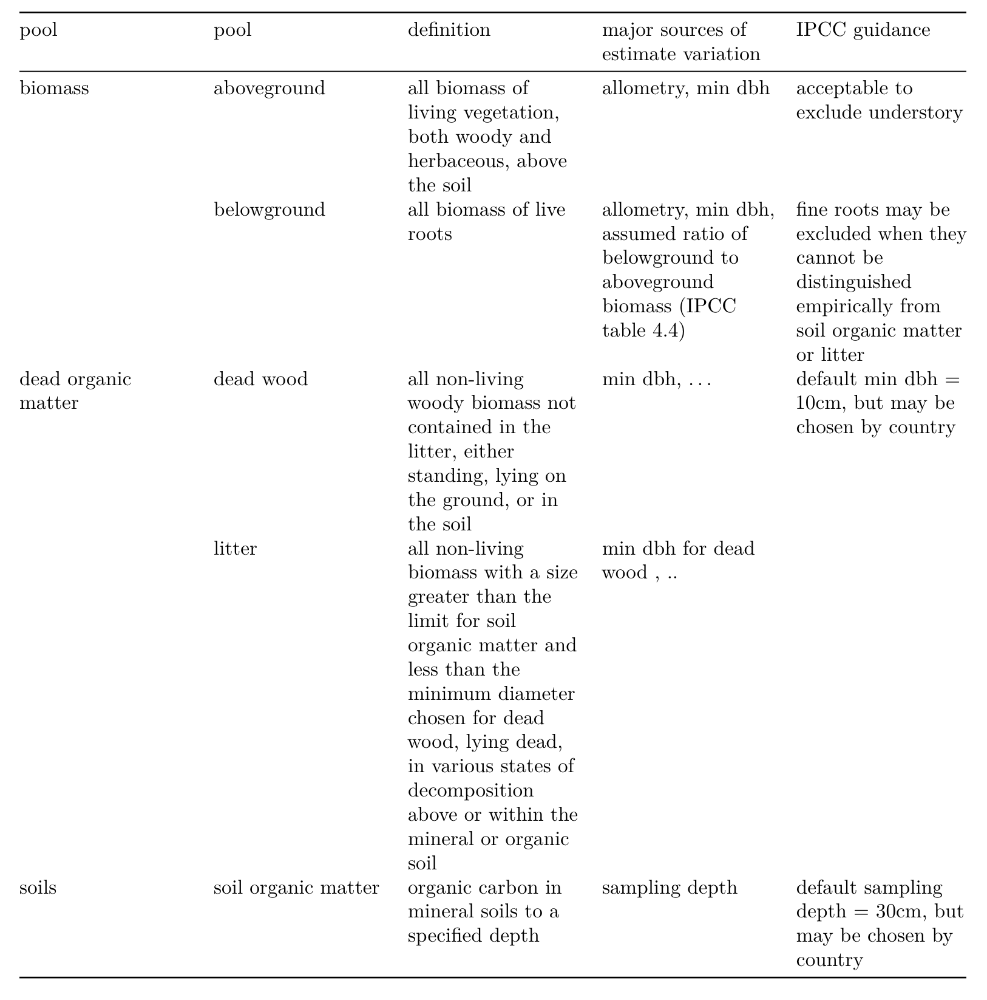

The following settings can or must be configured in the header of this file and are bespoke for Copernicus manuscripts:

- The `journal` you are submitting to using the official abbreviation. You can use the function `rticles::copernicus_journal_abbreviations(name = '...')` to search the existing journals.

- Specific sections of the manuscript:

  - `running` with `title` and `author`

  - `competinginterests`

  - `copyrightstatement` (optional)

  - `availability` (strongly recommended if any used), one of `code`, `data`, or `codedata`

  - `authorcontribution`

  - `disclaimer`

  - `acknowledgements`

See the defaults and examples from the skeleton and the official Copernicus documentation for details.

**Important**: Always double-check with the official manuscript preparation guidelines at [https://publications.copernicus.org/for_authors/manuscript_preparation.html](https://publications.copernicus.org/for_authors/manuscript_preparation.html), especially the sections "Technical instructions for LaTeX" and "Manuscript composition".
Please contact Daniel Nüst, `daniel.nuest@uni-muenster.de`, with any problems.

\introduction[Introduction]

*(Importance of forests for climate change mitigation)*


*(Need for good data in international carbon accounting)*


*(Introduce EFDb & forc)*

Example citation [@anderson-teixeira_forc_2018]

Here, we:
(1) clarify C cycle terminology
(2) describe mapping of ForC to IPCC's EFDB,
(3) describe updates to ForC  (ForC v4.0)
(4) summarize the data in ForC that's relevant to EFDB, identifying gaps
(5) provide recommendations for improving data collection, analysis, database, and accounting

# Defining carbon stocks and incremenets

For quantifying forest role in global C cycle, we ultimately care about:
(1) C stocks --stores of C that would be released to the atmosphere upon and use change
(2) C increments -- changes in those C stocks.

## Carbon stocks

Forest ecosystem C stocks may be parsed into pools in various ways. 
IPCC parses into biomass (aboveground and belowground), dead organic matter (dead wood and litter), and soil organic matter (Table 1).
Quantifying these requires a one-time measurement.

\newpage 

**Table 1: variables with definitions and measurement methods.** Definitions from IPCC Table 1.1. (See Table 1.1 in IPCC guidance). (*Currently adding this as a figure (generated from original draft) because kableExtra doesn't seem to work in this template, and I can't quickly get the template format to work. Table that we want here is "figures_tables/C_pools.csv"*)

```{r, out.width = "12cm", echo = FALSE, fig.cap = "Table 1"}
#this is for a two-column figure. for one-column figure, use {r, out.width = "8.3cm", echo = FALSE, fig.cap = "one column figure"}

```


\begin{table*}[t]
\caption{This is a start at table 1 using the template format. }
\begin{tabular}{l c c c r}
\tophline

pool & subpool & definition & major sources of estimate variation & IPCC guidance \\
\middlehline
biomass & aboveground & all biomass of living vegetation, both woody and herbaceous, above the soil & allometry, min dbh & acceptable to exclude understory  \\

\bottomhline
\end{tabular}
\belowtable{I don't know how to adjust so that it doesn't run off the page.}
\end{table*}


## Carbon increments

C increments are defined as the change over time, in annual increments, in each C pool.
These may be estimated as the difference between C stocks at two time points, or as the difference between inputs and outputs to the pool (i.e., fluxes).
Quantifying these requires at least two measurements.

Fluxes are the inputs and outputs to each pool. 


**Figure: schematic illustrating fluxes in and out of each pool**


\conclusions[Conclusions]

The conclusion goes here.
You can modify the section name with  `\conclusions[modified heading if necessary]`.
