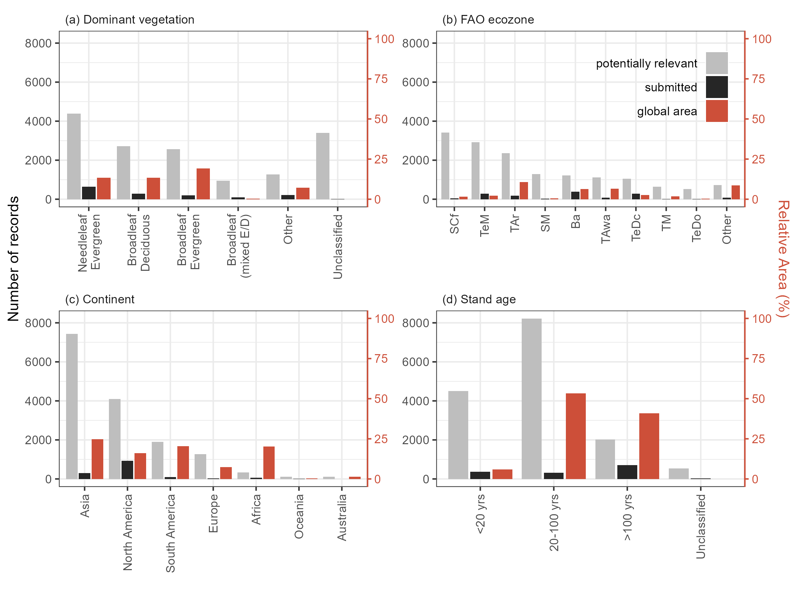

<!--**Important**: Always double-check with the official manuscript preparation guidelines at [https://publications.copernicus.org/for_authors/manuscript_preparation.html](https://publications.copernicus.org/for_authors/manuscript_preparation.html), especially the sections "Technical instructions for LaTeX" and "Manuscript composition".
Please contact Daniel Nüst, `daniel.nuest@uni-muenster.de`, with any problems.-->

```{r eval = TRUE, echo=FALSE, warning=FALSE, results='hide'}
#Tables
table_pools =1
table_variables =2
table_recommendations = 3

#Figures
fig_variable_mapping=1
fig_map=2
fig_histograms=3

#Cited sections (listed here because these can change)
section_C_pools = 2.1 
section_land_use_categories = 2.2
section_new_variables = 3.2
section_C_variable_mapping = "4.1.1"
section_land_use_mapping = "4.1.2"
section_database_needs = "6.1"
section_new_data_needs = "6.2"
section_data_reporting_needs = "6.3" 
section_mismatches = 6.4

#Appendices
table_ForCchanges = "Appendix A"
table_ForCfieldmapping = "Appendix B"

#READING IN FILES TO GET FIGURES/ TABLES/ STATS 
path_to_dir <- dirname(dirname(getwd())) # get path to repo 
path_to_ForC= "/Users/kteixeira/Dropbox (Smithsonian)/GitHub/ForC-db" #Krista's laptop
# path_to_ForC= "/Users/kteixeira/Dropbox (Smithsonian)/GitHub/ForC-db" #Madison, to knit, you'll need to enter the path to ForC-db on your computer, then un-comment this line.

# MOVE FIGURE FILES 
#world map from GitHub
do.call(file.remove, list(list.files(paste0(path_to_dir, "/doc/manuscript/figures_tables"), "World_Map_of_sites_with_FAO_and_IPCC_data_sent.png", full.names = TRUE))) # first remove old file
flist <- list.files(paste0(path_to_ForC, "/ForC/figures/"), "World_Map_of_sites_with_FAO_and_IPCC_data_sent.png", full.names = TRUE)
file.copy(flist, paste0(path_to_dir, "/doc/manuscript/figures_tables"))


#Statistics
ForC_measurements <- read.csv(paste0(path_to_ForC,"/ForC/data/ForC_measurements.csv"), stringsAsFactors = FALSE, check.names = FALSE)
n_records_ForC= length(ForC_measurements[,"measurement.ID"])  # total n records in ForC

ForC_plots <- read.csv(paste0(path_to_ForC,"/ForC/data/ForC_plots.csv"), stringsAsFactors = FALSE, check.names = FALSE)
n_plots_ForC = length(ForC_plots[,"plot.ID"]) # total n plots in ForC

ForC_sites <- read.csv(paste0(path_to_ForC,"/ForC/data/ForC_sites.csv"), stringsAsFactors = FALSE, check.names = FALSE)
n_areas_ForC = max(ForC_sites$geographic.area, na.rm = TRUE) # total n geographic areas in ForC

ForC_simplified <- read.csv(paste0(path_to_ForC,"/ForC/ForC_simplified/ForC_simplified.csv"), stringsAsFactors = FALSE, check.names = FALSE)
n_independent_records_ForC= length(ForC_simplified[,"measurement.ID"]) #suspected duplicates removed. This is the number of records fin ForC simplified.

C_variables <- read.csv(paste0(path_to_dir,"/doc/manuscript/figures_tables/C_variables.csv"), stringsAsFactors = FALSE, check.names = FALSE)
n_ind_records_EFDB_variables= C_variables[length(C_variables[,"variable"]), "n independent records in ForC"] #n independent records relevant to EFDB

n_records_reviewed_or_added= C_variables[length(C_variables[,"variable"]), "n reviewed"]
n_records_added = max(ForC_measurements$measurement.ID) -48956 # Madison's entries start with measurement.ID = 48956
n_records_checked = n_records_reviewed_or_added - n_records_added # this will be hard to get at, but we can at least estimate a minimum (= previously existing records in records sent to EFDB)


n_records_sent_to_EFDB = C_variables[length(C_variables[,"variable"]), "n sent to EFDB"] # n records sent to EFDB

n_records_posted_EFDB = 73 # n records accepted and posted in EFDB (easy to determine by entering "ForC" in the "Other Properties" search field of EFDB: https://www.ipcc-nggip.iges.or.jp/EFDB/find_ef.php. Then get number from upper left box where it says "displayed records")

n_new_variables = 11 + 2 + 2 #delta. + woody.mortality + O horizon
# get n fields modified
sampling_details <- read.csv(paste0(path_to_ForC,"/ForC/database_management_records/record_of_changes.csv"), stringsAsFactors = FALSE, check.names = FALSE)
n_fields_modified =  length(sampling_details[,"Column"]) + 4 


```

****
*THIS IS AN IN-PREP MANUSCRIPT.*

****

**Abstract.**
Forests are critical for climate change mitigation and consitute a substantial portion of planned emissions reductions under the 2015 Paris Agreement.
Yet, the efficacy of greenhouse gas mitigation planning and reporting is dependent upon the quality of available emission factors data, including forest carbon (C) stocks and changes therein.
Tens of thousands of relevant forest C estimates have been published, yet are not readily accesible to the practitioners compiling national greenhouse gas inventories. 
Many of these data have, however, been compiled in the Global Forest C database (ForC; https://forc-db.github.io/) and stand to be of value to greenhouse gas accounting if made available through the Emission Factor Database (EFDB) of the International Panel on Climate Change (IPCC).
Here, we develop and document a process for semi-automated transfer of data from ForC into the EFDB, assess the data available and transferred to date, and provide recommendations for improving forest data collection, analysis, and reporting to improve accounting of forest-sector greenhoouse gas emissions and removals.
We begin by reconciling terminology and mapping ForC fields into EFDB.
This process required some updates to the ForC database structure, leading to the release of a new version of ForC (v4.0; described here).
At the time of writing, ForC contained ~`r n_ind_records_EFDB_variables` independent records that would be relevant to EFDB, `r n_records_sent_to_EFDB` of which have been submitted to date.
Among the data in ForC, there is disproportionate representation of biomass (particularly aboveground) stocks, with far fewer records for dead organic matter and soil carbon, and relatively few or no records for net annual increments or C fluxes into (gains) or out of (losses) the IPCC-defined C pools.
Geographic representation is also quite uneven, with the highest densities of relevant records in temperate forests, and with relatively scant representation of tropical forests in Africa and Asia. 
ForC represents a diversity of stand ages, although records for young stands are primarily limited to C stocks, as opposed to net increments of fluxes.
This distribution of records is generally reflected in the subset of records that have been submitted to EFDB to date.
In the future, forest C estimates in EFDB can be improved through targeted research to fill critical gaps, reporting of information required by IPCC, and continued submission of data from scientific publications to the EFDB.
Given that climate change is rapidly impacting the world's forests, timely reporting of recent estimates will be especially critical to accurate forest C accounting.  

\introduction[Introduction]

Forests are critical to management of atmospheric concentrations of the greenhouse gas carbon dioxide (CO~2~), and thereby climate change. 
In recent decades, CO~2~ uptake by forests, woodlands, and savannas has exceeded releases from deforestation and other severe disturbances, resulting in a net carbon CO~2~ sink of ~0.88 Gt C yr^-1^ [all biomes with trees, @xu_changes_2021] to ~`r round(5.8*12/44,1)` Gt C yr^-1^<!--net forest estimate in Harris et al. Table 2--> [forests only, @harris_global_2021].
This has offset an estimated `r round(.88*44/12/32,2)*100`%<!--net forest estimate from xu_changes_2021 / fossil fuel & cement, (Harris et al. Table 2)--> to `r round(5.8/32,2)*100`%<!--net forest estimate / fossil fuel & cement, (Harris et al. Table 2)--> of anthropogenic CO~2~ emissions from fossil fuels and cement [@xu_changes_2021;@harris_global_2021], dramatically slowing the pace of atmospheric CO~2~ accumulation and climate change.
Going into the future, the fate of this important CO~2~ sink is highly uncertain, depending both upon forest responses to climate change, which are likely to reduce the sink strength [@mcdowell_pervasive_2020;@hammond_global_2022], and on human conservation, restoration, and management of forests [@ipcc_climate_2019;@ipcc_climate_2022].

Reflecting their strong influence on Earth's climate, forests play a central role in international plans for climate change mitigation under the Paris Agreement [@unfccc_adoption_2015].
Forest conservation, reforestation, and improved sustainable management all have significant -- and relatively cost-effective -- potential as climate change mitigation options, with conservation and reforestation having the fourth and fifth largest net emission reduction potentials or all mitigation options [@ipcc_summary_2022].
As of 2016, forest-based mitigation accounted for 26% of total planned greenhouse gas mitigation within Nationally Determined Contributions under the Paris Agreement [@grassi_key_2017].
Yet, envisioned forest-based climate change mitigation initiatives do not always correspond to actual emission reductions through on-the-ground implementation [e.g., @badgley_systematic_2022].
One critical need for ensuring that forest-based climate change mitigation initiatives are effective is realistic planning and reporting, underlain by solid scientific data [@anderson-teixeira_effective_2022; @deng_comparing_2021].

The International Panel on Climate Change (IPCC) provides guidance for national greenhouse gas inventories for reporting to the United Nations Framework Convention on Climate Change [UNFCCC, @ipcc_2006_2006;@ipcc_2019_2019].
Under this guidance, greenhouse gas inventories include all managed land, including most of the world's forest land [@ogle_delineating_2018].
The IPCC inventory guidelines include specific instructions for accounting for greenhouse gas (mainly CO~2~) exchanges between forest land and the atmosphere [@ipcc_agriculture_2006; @ipcc_2019_2019].
This guidance has improved over the years as more of the relevant underlying data has become available [@requenasuarez_estimating_2019; @rozendaal_aboveground_2022], but there remains room for continuous improvement as the science advances.
For example, the year following the release of the latest IPCC guidelines, @cook-patton_mapping_2020 found that the latest default rates may underestimate rates of C accumulation in regrowth forests by 32% on average and fail to capture eight-fold variation within ecozones. 
In addition, @cuni-sanchez_high_2021 found that aboveground C stocks in mature African tropical montane forests were two-thirds higher than the IPCC default values for these forests.
This rapid evolution of scientific information on the climate mitigation potential of forests is beneficial to climate mitigation efforts, but requires improved mechanisms for communicating the latest information from scientific researchers to the practitioners who need reliable estimates for greenhouse gas mitigation planning. 
Moreover, high variability of forest C cycling within ecozones [e.g., @cook-patton_mapping_2020; @cuni-sanchez_high_2021] implies that it is useful for practitioners to have access to locally-specific information, when available.

To improve the data accessible for C accounting, the IPCC created the Emission Factor Database (EFDB; [https://www.ipcc-nggip.iges.or.jp/EFDB/main.php](https://www.ipcc-nggip.iges.or.jp/EFDB/main.php)), which is intended as a recognized library of emission factors and other parameters that can be used for estimating greenhouse gas emissions and removals.
The EFDB can be used both for efforts to tally a nation's intended or accomplished greenhouse gas reductions, or as a basis of comparison for external parties to evaluate these inventories. 
The EFDB encourages researchers to submit estimates of emission factors or other related parameters from peer-reviewed journal papers or other accepted sources for inclusion in the database. 
In the case of forests, emission factors include carbon stocks, net increments ("stock changes"), and fluxes ("gains" and "losses") for various pools [@ipcc_2006_2006;@ipcc_2019_2019].

The Global Forest Carbon Database, ForC ([https://forc-db.github.io/](https://forc-db.github.io/)), is the largest collection of published estimates of forest carbon stocks, increments, and annual fluxes [@anderson-teixeira_forc_2018; @anderson-teixeira_carbon_2021].
ForC includes data ingested from individual publications and relevant databases, including the Global Reforestation Opportunity Assessment (GROA) database [@cook-patton_mapping_2020, database doi: 10.5281/zenodo.3983644], the global soil respiration database [SRDB-V5, @bond-lamberty_global_2010; @jian_restructured_2021].
For C currently contains `r n_records_ForC` records from `r n_plots_ForC` plots in `r n_areas_ForC` distinct geographical areas, along with records of stand age and disturbance history.
As such, ForC is positioned to improve forest C accounting through the transfer of data to EFDB.
The purpose of this publication is to document that process and provide recommendations for future improvements.

Here, we
(1) review IPCC methods and definitions for tallying forest C;
(2) describe mapping of ForC to IPCC's EFDB;
(3) describe updates to ForC  (ForC v4.0), most of which were implemented to facilitate data transfer to EFDB;
(4) summarize the data in ForC that's relevant to EFDB and records that have been transferred to date; and
(5) provide recommendations for improving data collection, analysis, database, and accounting.


# IPCC methods and definitions 

The end goal of IPCC greenhouse gas inventories is to quantify greenhouse gas emissions to, or withdrawals from, the atmosphere on an annual basis, most commonly on a national level [@ipcc_2006_2006;@ipcc_2019_2019]. 
For each stratum of subdivision within a land-use category, annual stock changes ($\Delta C$; t C yr^-1^) are calculated as the sum of changes in various pools (section `r section_C_pools`), plus any harvested wood products.
For each pool, $\Delta C$ may be calculated using the "Gain-Loss Method", which takes the difference between gains and losses<!--IPCC eq.2.4-->, or using the "Stock-Difference Method", which computes $\Delta C$ based on C stocks at two points in time<!--IPCC eq.2.5--> [@ipcc_2006_2006]. 
Thus, C cycle variables relevant to the IPCC methodology and to EFDB include C stocks, net annual increments, and fluxes in the IPCC-defined pools.


## Carbon pools

Forest ecosystem C pools may be parsed in various ways, and while certain definitions and thresholds are more common than others, there is no single standard for measuring or reporting that is adhered to by all -- or even most -- studies. 
IPCC parses forest C pools into biomass (aboveground and belowground), dead organic matter (dead wood and litter), and soil organic matter (Table `r table_pools`).
While there is some flexibility around the components included in each pool, each national inventory must apply these in a consistent manner.
In this section, we define and review the IPCC definitions in the context of typical forest C estimation methodologies.


```{r table_pools, eval = TRUE, echo=FALSE, warning=FALSE}
C_pools_table <- read.csv("figures_tables/C_pools.csv")
names(C_pools_table) <- stringr::str_replace_all(names(C_pools_table), "\\.", " ")

library(knitr)
library(kableExtra)
knitr::kable(C_pools_table, format = "latex",
             longtable = FALSE,
             caption = "\\textbf{IPCC-defined forest carbon pools with definitions and measurement methods.} Definitions from IPCC Table 1.1. (See Table 1.1 in IPCC guidance).") %>%
  row_spec(0, bold = TRUE) %>%
  kableExtra::kable_styling(full_width = TRUE) 
  #kable_styling(latex_options = c("scale_down", "hold_position"), protect_latex = T) 
```


### Biomass
Biomass includes living vegetation, above- and below-ground, both woody and herbaceous, but with a focus on woody plants and trees given their much greater potential to sequester large amounts of C [@ipcc_2006_2006].

Aboveground biomass, which is typically <200 t C ha^-1^ but can exceed 700 t C ha^-1^ [@anderson-teixeira_carbon_2021], is defined by the IPCC as "all biomass of living vegetation above the soil including stems, stumps, branches, bark, seeds, and foliage" [@ipcc_good_2003;@ipcc_2006_2006].
IPCC's guidance is that the understory may be excluded the understory if it constitutes a "minor" component, *where quantitative definitions of "understory" and "minor" are not provided*<!--verify-->, but where a commonly applied minimum size sampling threshold for mature forests would be 10 cm stem diameter at breast height (DBH).
A recent study characterizing the contributions of trees in different DBH classes to ecosystem C stocks and fluxes found that trees 1 - 10 cm DBH contributed up to ~8% aboveground biomass, ~17% aboveground woody net primary productivity ($ANPP_{woody.stem}$), and ~20% woody mortality ($M_{woody}$) of mature closed-canopy forests worldwide [@piponiot_distribution_2022].
In regrowth forests, woodlands, or savannas, small trees and shrubs contribute a much larger proportion of C stocks and fluxes [@piponiot_distribution_2022; @refs], and, correspondingly, biomass estimates for these ecosystems tend include smaller size classes [e.g., @refs]. 
Beyond the minimum DBH sampled, forest censuses and biomass estimates also differ in their inclusion of life forms other than dicot trees -- including lianas, ferns, palms, and bamboo -- which in some places can reach large sizes and/or constitute a large fraction of forest C.
*[explain IPCC guidance]*
Further, it is important to note that this excludes standing dead wood, which is included in remote sensing biomass estimates [@duncanson_aboveground_2021].

A universal challenge in estimating biomass (living or dead) from forest census data is applying appropriate allometries to convert DBH measurements to biomass.
Selection of allometries has an enormous influence on estimates of biomass stocks, increments, of fluxes [@clark_landscapescale_2000;@clark_net_2001].
While trusted and standardized allometric equations are becoming increasingly available [@chave_improved_2014;@rejou-mechain_biomass_2017;@gonzalez-akre_allodb_2022], large uncertainties remain.
*[explain IPCC guidance]*

Belowground biomass is defined as "all biomass of live roots" [@ipcc_good_2003;@ipcc_2006_2006], a definition including both coarse roots, whose biomass is typically estimated based on stem censuses and allometries or belowground to aboveground biomass ratios, and fine roots, whose biomass is typically estimated via extraction of roots from soil samples.
The former, which is typically <40 t C ha^-1^ [@anderson-teixeira_carbon_2021], is methodologically linked to aboveground biomass estimates, sharing the same methodological sources of variation, but tending to be far more uncertain.
Fine root biomass generally constitutes a much smaller C pool [typically <5 t C ha^-1^, @anderson-teixeira_carbon_2021], and IPCC guidance is that it can be excluded when fine roots cannot be distinguished empirically from soil organic matter or litter [@ipcc_2006_2006], which can be a painstaking process. 
Field methods for estimating root biomass are highly variable.
IPCC's default method for Tier 1 estimates is to apply a ratio of belowground to aboveground biomass, with default factors defined based on ecological zone, continent, and forest age<!--IPCC table 4.4--> [@ipcc_2006_2006;@ipcc_2019_2019].

### Dead Organic Matter

Dead organic matter includes all non-living biomass that is not within the mineral soil layer and smaller than the litter size threshold. 
It's inclusion in inventories is not required under Tier 1 methodology for Forest Land remaining Forest Land (see section `r section_land_use_categories`), but is required for land that has transitioned to or from forest within the past 20 years [@ipcc_2006_2006].

Dead wood, which is typically <50 t C ha^-1^ but can exceed 150 t C ha^-1^ [@anderson-teixeira_carbon_2021], is defined by IPCC as "all non-living woody biomass not contained in the litter, either standing, lying on the ground, or in the soil" [@ipcc_good_2003;@ipcc_2006_2006]. 
This pool includes standing and fallen dead wood, stumps, and dead roots of diameter ≥10 cm (or a diameter specified by the country).
While dead wood stocks and fluxes can be quite variable across forests [@anderson-teixeira_carbon_2021], and can at times be the dominant pool in a forest ecosystem [e.g., following a severe natural disturbance; @carmona_coarse_2002], aboveground dead wood remains relatively poorly characterized at a global scale [@anderson-teixeira_carbon_2021], and belowground dead wood is rarely studied [@merganicova_dadwood_2012].
In turn, they are poorly characterized in large-scale forest C budgets [@pan_large_2011;@harris_global_2021], and IPCC's latest Tier 1 default values are based on just 1-31 references per climate zone [Table 2.2 in @ipcc_2019_2019].<!--table 2.2-->

Litter, which is typically <40 t C ha^-1^ but can exceed 100 t C ha^-1^ [@anderson-teixeira_carbon_2021], is defined by IPCCC as including "all non-living  biomass  with  a  diameter  less  than  a  minimum  diameter  chosen  by  the  country  (for  example 10 cm), lying dead, in various states of decomposition above the mineral or organic soil" [@ipcc_good_2003;@ipcc_2006_2006].
As noted above, live fine roots may be included in litter when difficult to separate empirically.
The definition includes the entire O horizion, including litter (OL), fumic (OF), and humic (OH) layers, in addition to litter embedded within the soil.
This definition contrasts with empirical studies that focus on aboveground litter, often including only the OL layer in the definition of litter, and do not always specify the components included.
Similar to dead wood, litter is poorly characterized in large-scale forest C budgets [@pan_large_2011;@harris_global_2021], and IPCC's latest Tier 1 default values are based on just 1-7 references per climate zone [Table 2.2 in @ipcc_2019_2019].<!--table 2.2-->

### Soil Organic Matter/ Carbon

Soil organic matter/ carbon (SOM/ SOC), which *(statistic on how much C is typial)* [@ref], is defined by IPCC as "organic carbon in mineral and organic soils (including peat) to a specified depth chosen by the country and applied consistently through the time series" [@ipcc_good_2003;@ipcc_2006_2006]. 
Live fine roots (suggested diameter cutoff of 2 mm) may be included with soil organic matter when it is not feasible to distinguish them empirically.
The greatest source of methodological variation in measuring SOM/ SOC is sampling depth, which has a suggested default of 30 cm but may vary by country provided that consistent criteria are applied. 

## Land classification
IPCC defines land-use categories to include six categories -- Forest Land, Grassland, Wetlands, Cropland, Settlements, and Other Land [@ipcc_2006_2006].
Sub-divisions include land that has remained in a particular category for >20 years (e.g., Forest Land remaining Forest Land) and land that has been converted from one category to another in the past 20 years (e.g., Cropland converted to Forest Land). 
Forest Land is defined as at least 10-30% crown cover of trees with potential to reach a minimum height of 2-5 m *in situ*, and shorter-stature natural vegetation would be classified as Grassland [@ipcc_good_2003].
Definitions of forest are allowed to vary by country, but must be applied consistently.
Forest Land includes land where vegetation temporarily falls below the threshold values for forest (e.g., due to disturbance), but is expected to exceed those thresholds in the future [@ipcc_good_2003].

The UNFCCC requires greenhouse gas reporting for all managed lands in a country, where management is defined as "human interventions and practices have been applied to perform production, ecological or social functions" [@ipcc_2006_2006]. 
This expansive definition of managed land implies that the majority of Forest Land in most countries is managed [e.g.,].
However, the definition is applied differently across countries, and the majority of governments have yet to report their approach for defining managed land or provide maps of managed land [@ogle_delineating_2018; @deng_comparing_2021].


# Updates to ForC (ForC v4.0)

Previous versions of ForC [@anderson-teixeira_carbon_2016; @anderson-teixeira_forc_2018; @anderson-teixeira_carbon_2021] contained most of the information required by EFDB, and, more broadly, to inform C accounting under IPCC guidelines. 
However, modest changes to the structure and contents of ForC were needed in order to provide all information required by EFDB and to improve ForC's capacity to serve as a repository of valuable information for forest C accounting under IPCC guidelines.
To support export of data to EFDB, and to improve the overall quality of the ForC database, we added or modified `r n_fields_modified` fields (`r table_ForCchanges`), defined `r n_new_variables` new variables, implemented enhanced quality control, manually reviewed ># records to obtain additional required information, and added `r n_records_added` new records.

This section describes changes relative to ForC v3.0 [@anderson-teixeira_carbon_2021].

## New or modified fields

We added or modified a total of `r n_fields_modified` fields (`r table_ForCchanges`).
Most notably, these included improvement of the representation of uncertainty, recording of original units and organic matter to C conversion factors, and expanding the information recorded in the citations table. 
For the latter, we *used an R script to automatically retrieve information based on the DOI*<!--needs info from Valentine here-->.  

## New variables

We added a total of `r n_new_variables` new EFDB-relevant variables to the set of named and defined variables (Fig. `r fig_variable_mapping`), counting each pair of variables with units in C (ending in  `_C`) or organic matter (ending in `_OM`) as one. 
This included eleven increment variables, adding to only one previously defined increment variable (aboveground biomass increment, *delta.agb*). 
These are directly related to C stocks as previously defined in ForC, with "*delta.*" added in front of the variable name.
Further, we added variables capturing the belowground component of woody mortality (*woody.mortality_root*) and the combined aboveground and belowground components of woody mortality (*woody.mortality*).
Although most of these variables currently lack records in ForC, the structure exists such that records can be populated over time. 
Finally, to provide better definition of the previously existing variable *organic.layer*, which has a nebulous definition that reflects the varied definitions adopted by original studies, we added two clearly defined variables: *litter* (relatively undecomposed plant material/ OL horizon), and *O.horizon* (entire O-horizon, including OL).

```{r fig_variable_mapping, out.width = "14cm", echo = FALSE, fig.cap = "\\textbf{Schematic illustrating the carbon pools quantified under IPCC accounting; corresponding ForC variables, and relationships among them.} For each C pool, we show ForC variables corresponding to the stock, stock change (net annual increment), gain (influx), and loss. Most, but not all, EFDB-relevant ForC variables are shown here. Correspondence of ForC variables to IPCC criteria often depends upon measurement protocols (e.g., min DBH). Additional caveats are as follows: (a,b) branch fall and mortality of stems below census min DBH, which are necessary for a full accounting of dead organic matter production but typically assumed negligible for calculations of biomass change, are excluded by common measurement practice (a) or ForC variable definition (b); (c) assumes that leaf production equals leaf fall, or that changes in foliage biomass are negligble; (d,e) belowground components excluded by common measurement practice (d) or ForC variable definition (e); (f) excludes movement of dead wood into litter through breakage or size reduction; (g) measurements often limited to litter horizon (OL) and may exclude larger branches and stems classified as litter and/or the more decomposed layers of the O horizon."}
#this is for a two-column figure. for one-column figure, use out.width = "8.3cm"
knitr::include_graphics("figures_tables/C_variable_mapping.png")
```


## Quality control measures
Prior to releasing ForC v4.0, we executed several quality control measures.
First, we implemented a system of continuous integration using GitHub Actions [*sensu* @kim_using_inreview] to run some automatic checks any time the master data files are updated, including outlier tests and checks for completeness and naming consistency of records across data files.
Second, to improve information on geographic coordinates, we created a field to record coordinate precision (`r table_ForCchanges`), and flagged and reviewed records with suspected low precision *(Issue #29)[https://github.com/forc-db/ForC/issues/229]*.
Third, to identify erroneous climate data... *(Issue #212)[https://github.com/forc-db/ForC/issues/212]*.

Because ForC v4.0 contained known duplicate records, we used R scripts to remove likely duplicates, as detailed in @anderson-teixeira_carbon_2021.
Henceforth, we refer to the set of records with likely duplicates removed as "independent records".
All records sent to EFCB were ensured to be original through manual review, as detailed below.

## Manual review of records to be sent to EFDB

EFDB data submissions required information that was not recorded in previous versions of ForC, but rather was recorded in fields (`r table_ForCchanges`).
It was therefore necessary to return to original publications to retrieve relevant information, including 
(1) whether records of interest were presented in tables / text or digitized from figures (EFDB will not accept digitized data, whereas ForC does), 
(2) whether records of interest were presented directly, as opposed to having been calculated from related variables (for example, if a study presents aboveground biomass and root biomass but not total biomass, ForC would accept the sum of these as a valid estimate of total biomass, whereas EFDB would not)
(3) estimates in original units, 
and (4) confidence intervals (when not already in ForC).
We also checked that existing ForC records were complete and correct.

Manual review of records was the limiting step for data transfer to EFDB. 
We prioritized review of
(1) records from the Forest Global Earth Observatory [ForestGEO, @anderson-teixeira_ctfsforestgeo_2015; @davies_forestgeo_2021],
(2) studies with confidence intervals recorded in ForC (because uncertainty estimates are important to the IPCC),
(3) original publications containing large numbers of EFDB-relevant records,
and (4) records from tropical regions.
The latter criteria was motivated by the fact that although tropical forest is the single most important biome for climate change mitigation [@refs], ground-based data on tropical forest C cycling tend to be more scarce due to a variety of challenges [@delima_making_2022], and *tropical countries are more likely to apply Tier 1 methodology that bases forest C budgets on previously existing data [@ref].* <!-- I'm almost certain this is true, but need to confirm/ find ref.-->

## Addition of new records

In addition to reviewing existing records, we added a total of `r n_records_added` new records to ForC.
These included **##** records from **##** studies [@piponiot_distribution_2022; @lutz_largediameter_2021; @refs<!--others?-->] that were not previously included in ForC.
In addition, we created new records for **##** EFDB-relevant estimates presented in the original publication that were not yet present in ForC.

# Transfer of data from ForC to EFDB

To transfer complete, reviewed ForC records into EFDB, we created R scripts to restructure ForC records and populate EFDB's bulk import form ("EFDB bulk import.xlsx").
Criteria for data transfer were that (1) records had been checked against the original study and determined to be complete and correct (`EFDB.ready` field in `ForC_citations` table), (2) the original study presented values in tables or text, as opposed to the values having been digitized from graphs or calculated based on related variables (`data.location.within.source` field in `ForC_measurements` table), and (3) the records had not previously been sent to EFDB.
Once converted into EFDB format, the records were reviewed and then sent to the IPCC's Technical Support Unit for inclusion in EFDB. 
Complete records needed to be reviewed by the EFDB editorial board prior to posting in the database -- a process that lags behind records transfer and had not yet been completed for all records sent as of `r format(Sys.time(), '%B %d, %Y')`.

## Mapping ForC to EFDB

The mapping of ForC fields into EFDB fields is summarized in `r table_ForCfieldmapping`, with details documented in the public GitHub repository associated with the project, IPCC-EFDB-integration repository within the ForC-db organization (file *ForC-EFDB_mapping.csv* available at [https://github.com/forc-db/IPCC-EFDB-integration/blob/main/doc/ForC-EFDB_mapping/ForC-EFDB_mapping.csv](https://github.com/forc-db/IPCC-EFDB-integration/blob/main/doc/ForC-EFDB_mapping/ForC-EFDB_mapping.csv)). 

For the majority of fields, contents of the field in ForC was transferred directly into an EFDB field, either as the only contents of that field or as part of a composite record.
For example, ten ForC fields describing site location, climate, and edaphic properties all mapped into the EFDB field `Region/Regional conditions` (`r table_ForCfieldmapping`).
In cases where original studies did not present 95% confidence intervals (required by IPCC when available) but did present information required to calculate these (standard error or n and standard deviation), we calculated the 95% confidence intervals and populated the EFDB field with this information (noting the calculation in the EFDB field `Comments from Data Provider`).
For some fields, simple conditional logic was used to populate EFDB fields based on ForC records. 
For example, for stock variables presented in the original publication in units of dry organic matter mass (as opposed to C), several greenhouse gasses (CO~2~, CO, CH~4~, NO, NO~2~, N~2~O) were entered in the EFDB field indicating the greenhouse gases to which the record could be pertinent (`Gases` field) because these values could be used in calculations of greenhouse gas emissions from biomass burning [@ipcc_2006_2006]; otherwise, the only pertinent greenhouse gas would be CO~2~. 
There were two cases in which more complex mapping was required: (1) mapping of C cycle variables (section `r section_C_variable_mapping`) and (2) land classification (section `r section_land_use_mapping`).

### Carbon cycle variables

With input from the IPCC's Technical Support Unit, we reviewed the list of ForC variables to identify those that were relevant to EFDB and to appropriately map them into EFDB (Fig. `r fig_variable_mapping`).
For each C pools (Table `r table_pools`), we identified variables representing organic matter or C stocks, stock changes (a.k.a. "net annual increments" by IPCC, "increments" in ForC), gains (a.k.a. "gross annual increments" by IPCC, "fluxes" in ForC), and losses ("fluxes" in ForC).
As described in section `r section_new_variables`, we also defined `r n_new_variables` new EFDB-relevant variables that were not previously represented in ForC. 
It it important to note that the correspondence of ForC variables to IPCC criteria often depends upon measurement protocols ("important sources of estimate variation" in Table `r table_pools`).
For example, ForC records of biomass and dead wood vary in the minimum stem diameter censused, such that some records would match the IPCC criteria whereas others would not.
Information on minimum diameters censused and other important sources of methodological variation are recorded as covariates in ForC and mapped into the EFDB field *Other Properties* (`r table_ForCfieldmapping`).
Details on the mapping of ForC variables to EFDB -- including associated covariates, IPCC pools (Table `r table_pools`) and relevant equations [@ipcc_2006_2006] -- are documented in the file ForC_variables_mapping.csv in the IPCC-EFDB-integration repository ([https://github.com/forc-db/IPCC-EFDB-integration/blob/main/doc/ForC-EFDB_mapping/ForC-EFDB_mapping.csv](https://github.com/forc-db/IPCC-EFDB-integration/blob/main/doc/ForC-EFDB_mapping/ForC-EFDB_mapping.csv)). 


### Land classification

Determination of the IPCC land-use category (i.e., Forest Land, Grassland, Wetlands, Cropland, Settlements, or Other Land; section `r  section_land_use_categories`) was made based on the categorical ForC field *dominant.life.form*, sometimes drawing upon stand age.
Records with "woody" *dominant.life.form* were classified as Forest Land.
Those with *dominant.life.form* of "woody+grass", which in ForC is indicative of anything from a shrub-encroached grassland to a tree-dominated savanna, were given dual classification of Forest Land and Grassland.
This dual classification indicates that records may be relevant to either category depending on the definition of forest applied (varies by country).
For (rare) cases where *dominant.life.form* was grass and stand age was greater than zero, indicative of early successional vegetation, we assigned a classification of Forest Land, consistent with the IPCC definition that Forest Land includes land expected to succeed to forest.
Cases where *dominant.life.form* was grass or crop and stand age was zero were indicative of a control for studies of forest regrowth following agricultural abandonment, and were classified as Grassland and Cropland, respectively.

Classification into sub-categories was dependent upon stand age and site history (section `r  section_land_use_categories`).
For Forest Land ≥ 20 years old or of unknown (relatively mature) age, or Forest Land < 20 years old that was forest prior to a stand-clearing disturbance, the past land-use category was Forest Land, making the sub-category "Forest Land Remaining Forest land".
For forests <20 years old with history including cultivation/ tillage or grazing, past land-use categories were Cropland and Grassland, respectively, making land-use subcategories were "Cropland converted to Forest Land" and "Cropland converted to Forest Land", respectively.
For forests <20 years old with unspecified previous agricultural use, we assigned the sub-category "Land Converted to Forest land".
Forests <20 years old with unknown land use prior to the study date were simply classified as "Forest Land".
The same logic was applied for savannas, but including both Forest Land and Grassland as potentially relevant categories. 

Given the lack of public information needed to determine whether lands are classified as mangaged [@ogle_delineating_2018; @deng_comparing_2021], and because the IPCC's definition of managed land is more expansive than is commonly applied in the scientific literature and hence in ForC, we did not transfer any classification of land management status from ForC to the EFDB.
However, we do provide auxiliary information that should be useful in making this determination, including geographical location and notable disturbance events. 

# Results

## ForC v4.0 contents

As of `r format(Sys.time(), '%B %d, %Y')`, ForC (v4.0) contained `r n_independent_records_ForC` independent records (`r n_records_ForC` total), `r n_ind_records_EFDB_variables` of which were for variables relevant to EFDB (Fig. `r fig_variable_mapping`).
These records were distributed across all forested continents and ecozones, with particularly high concentrations in *[ecozone(s)]* and low concentrations in *[ecozone(s)]* (Fig. `r fig_map`).
The most widely represented forest type was *[type]*, followed by *[type]* and *[type]* (Fig. `r fig_histograms`).


```{r fig_map, out.width = "15cm", echo = FALSE, fig.cap = "\\textbf{Map of sites in ForC shaded by number of records relevant to (circles) and transferred to (triangles) EFDB.} Symbols are colored according to the number of records at each site. Underlying map shows FAO ecozones, which are coded as follows: Ba-Boreal coniferous forest, Bb-Boreal tundra woodland, BM-Boreal mountain systems, P-Polar, SBSh-Subtropical steppe, SBWh-Subtropical desert, SCf-Subtropical humid forest, SCs-Subtropical dry forest, SM-Subtropical mountain systems, TAr-Tropical rain forest,  TAwa-Tropical moist deciduous forest, TAwb-Tropical dry forest, TBSh-Tropical shrubland, TBWh-Tropical desert, TeBSk-Temperate steppe, TeBWk-Temperate desert, TeDc-Temperate continental forest, TeDo-Temperate oceanic forest, TeM-Temperate mountain systems, TM-Tropical mountain systems."}
#this is for a two-column figure. for one-column figure, use out.width = "8.3cm"

```

```{r fig_histograms, out.width = "15cm", echo = FALSE, fig.cap = "\\textbf{Histograms of number of records in ForC relevant to (grey) and transferred to (black) EFDB, organized by (a) dominant vegetation type, (b) FAO ecozone, (c) continent, and (d) stand age.} For dominant vegetation (a), 'Other' includes deciduous needleleaf, mixed broadleaf- needleleaf, non-woody vegetation (e.g., early successional), and incompletely classified or mixed forest types. For FAO ecozones (b), codes are as listed in the caption of Figure 2."}
#this is for a two-column figure. for one-column figure, use out.width = "8.3cm"

```

ForC contained data for **##** of the **##** variables relevant to EFDB (Table `r table_variables`, Fig. `r fig_variable_mapping`).
The records were very unevenly distributed across variables ... 

\newpage
```{r table_variables, eval = TRUE, echo=FALSE, warning=FALSE}
C_variables_table <- read.csv("figures_tables/C_variables.csv")
names(C_variables_table) <- stringr::str_replace_all(names(C_variables_table), "\\.", " ")
C_variables_table[is.na(C_variables_table)]<- "" #replace NAs with blanks

library(knitr)
library(kableExtra)
knitr::kable(C_variables_table[,-1], format = "latex",  
             longtable = T,
             caption = "\\textbf{Numbers of records of ForC variables relevant to, and sent to, EFDB.}") %>%
  row_spec(0, bold = TRUE)  %>%
  row_spec(which(C_variables_table$bold), bold = TRUE) %>% #total
  kable_styling(font_size = 8) %>%
  #kableExtra::kable_styling(full_width = TRUE) 
  kable_styling(latex_options = c("hold_position", "repeat_header"), protect_latex = T) 
```


## Data transfers to EFDB

As of `r format(Sys.time(), '%B %d, %Y')`<!--inserts date upon knit-->, we had reviewed or added `r n_records_reviewed_or_added` EFDB-relevant records, `r n_records_sent_to_EFDB` records of which were sent to EFDB, and `r n_records_posted_EFDB` of which have been reviewed, accepted, and posted (Figs. `r fig_map`-`r fig_histograms`, Table `r table_variables`).
*[DETAILS]*

# Recommendations

Based on our experience contributing forest C data to EFDB via ForC, we make several recommendations as to how scientists can improve forest C records in EFDB through database work (section `r section_database_needs`), new data collection and analysis (section `r section_new_data_needs`), and reporting (section `r section_data_reporting_needs`).
We also highlight notable mismatches between IPCC accounting methods and forest C mensuration (section `r section_mismatches`).


## Database needs

There is vast potential to expand forest C data in EFDB by completing the process of reviewing and sending data that are already in ForC (Figs. `r fig_map`-`r fig_histograms`).
So far, only ~`r round(n_records_sent_to_EFDB/n_ind_records_EFDB_variables,2)*100`% of the EFDB-relevant data in ForC have been sent to EFDB.

Moreover, there are many published EFDB-relevant forest C data that are not included in ForC, with more being published on a nearly daily basis. 
Coverage of particular variables or regions could be vastly improved through systematic review of the literature.
*(There are some efforts underway, including a few that Susan can specify.)*
Such reviews are necessary to even develop a rigorous assessment of forest C data that are available, versus those that require additional data collection and analysis. 

## Data collection and analysis needs

New data collection and analysis is needed to fill notable knowledge gaps.
While aboveground biomass stocks in particular have received -- and continue to receive -- significant research attention, other pools and variables remain poorly quantified [Table `r table_variables`, @anderson-teixeira_carbon_2021].
Furthermore, data distribution is uneven across forest types and geographical regions (Figs. `r fig_map`-`r fig_histograms`).
For instance, C cycling of tropical forests -- particularly in Africa -- remains relatively poorly characterized, in large part due to substantial barriers to data collection and distribution [@delima_making_2022]
*(add some more here?)*

Several variables of value for IPCC C accounting have not been calculated and presented as would be possible given the same forest census data and minimal extra research effort.
For example, aboveground woody mortality (*woody.mortality_ag*) and aboveground biomass increment (*delta.agb*) can be calculated from the same census data as aboveground woody productivity (*ANPP_woody*), yet the latter has received far more research attention, and correspondingly has far more records in ForC [Table `r table_variables`, @anderson-teixeira_carbon_2021; but see @piponiot_distribution_2022]. 
Similarly, live coarse root biomass, total biomass, and changes in both of these pools could in theory be easily be estimated in parallel with aboveground biomass, with the greatest barrier being availability of reliable allometries, as have been developed for aboveground biomass [@chave_improved_2014;@rejou-mechain_biomass_2017;@gonzalez-akre_allodb_2022].
However, while equations for estimating root (and thereby total) biomass require improvement, they do exist *for many forest types*[@refs], and IPCC provides default recommendations of below-ground to above-ground ratios for estimation of root biomass [@ipcc_2019_2019].
In addition, standing dead trees are captured in most forest censuses and could be used to estimate standing dead wood, although additional data on breakage would be needed for accurate accounting. 
We recommend that, when possible, researchers calculate these, following the reporting guidelines specified in section `r section_data_reporting_needs`.

*Other EFDB-relevant variables require more effort but are warranted given their importance for forest C accounting.*
Given widespread trends of increasing tree mortality [@refs], including through severe natural disturbance [@refs], better characterization of dead wood will be critical.
...

## Data reporting needs

We recommend that, unless they have some specific reason to do otherwise, researchers calculate and report the values according to IPCC standards (Table `r table_recommendations`).
It is particularly noteworthy that simple decisions on the presentation of results will determine whether the data meet the criteria for inclusion in EFDB.
Some examples are as follows:
(1) presenting data only in a figure makes it ineligible for inclusion in EFDB, whereas presentation in a table or supplementary data file allows inclusion;
(2) direct presentation of all relevant variables allows inclusion, whereas presenting only components of variables of interest (e.g., parsing litter into fine woody debris, OL, OF, and OH layers) or requiring simple mathematical operations to obtain a variable of interest (e.g., *delta.agb* = *ANPP_woody* - *woody.mortality.agb*) disqualifies data from inclusion;
(3) matching IPCC-defined thresholds for defining C pools (Table `r table_pools`), which may vary by country, can make the data far more relevant for IPCC accounting (e.g., using a 10 cm cutoff between dead wood and litter, presenting soil C to a depth of 30 cm).
It should also be emphasized that reporting of 95% confidence intervals (or other metrics of error), when applicable, is highly desirable and makes the data more relevant to IPCC. Reports which had the most successful data transfers used EFDB variables and had clear tables showing their results. 

```{r table_recommendations, eval = TRUE, echo=FALSE, warning=FALSE}
recommendations_table <- read.csv("figures_tables/recommendations.csv")
names(recommendations_table) <- stringr::str_replace_all(names(recommendations_table), "\\.", " ")

library(knitr)
library(kableExtra)
knitr::kable(recommendations_table, format = "latex",
             longtable = FALSE,
             caption = "\\textbf{Recommended best practices for reporting forest C estimates of value to national greenhouse gas inventories under IPCC guidance. } ....") %>%
  row_spec(0, bold = TRUE)%>%
  kable_styling(font_size = 10) %>%
  kableExtra::kable_styling(full_width = TRUE) 
  #kable_styling(latex_options = c("scale_down", "hold_position"), protect_latex = T) 
```

For those compiling published data (e.g., for meta-analyses), the data set can have added value if all information required by IPCC is extracted from original publications. 
This includes -- but is not limited to -- retaining original values as presented without modification or rounding, noting whether data were digitized, recording confidence intervals, and recording all required fields (as indicated in the EFDB's bulk import template).
The significant effort required to map a database into EFDB has been accomplished here (`r table_ForCfieldmapping`), and we welcome other researchers to use the ForC template.

Once EFDB-relevant data are available in peer-reviewed publications, they may be submitted directly to EFDB or may use the ForC - EFDB data pipline developed here.
For individual publications, the former option will generally be more efficient.
However, by getting the data into ForC as well as EFDB, the latter option will allow the data to be more broadly useful--for example, being used for basic science [e.g., @banburymorgan_global_2021; @anderson-teixeira_carbon_2021] or model benchmarking [@fer_ecosystem_2021].


## Mismatches between IPCC accounting methods and forest C mensuration 

Remote sensing biomass estimates include standing dead wood [@duncanson_aboveground_2021].

IPCC accounting methods cannot leverage eddy-covariance measurements, which are widely seen as the best available method for quantifying ecosystem-atmosphere gas exchange. 

An important challenge is that forests are changing rapidly, and data collected a decade ago may no longer be relevant, particularly in the cases of C increments and fluxes.

# Conclusions

<!--The conclusion goes here.
You can modify the section name with  `\conclusions[modified heading if necessary]`.-->

\clearpage
# Appendix A. Updates to ForC {-}

\captionsetup[table]{labelformat=empty}
Table A1: **Table of changes to ForC fields.**
```{r table_ForCchanges, eval = TRUE, echo=FALSE, warning=FALSE, message = FALSE}
library (readr)
urlfile="https://raw.githubusercontent.com/forc-db/ForC/master/database_management_records/record_of_changes.csv"
record_of_changes <-read_csv(url(urlfile))
names(record_of_changes) <- stringr::str_replace_all(names(record_of_changes), "\\.", " ")
record_of_changes <- record_of_changes[c(1:5)] #include all fields but date of change
#record_of_changes<- record_of_changes[which(!grep("housekeeping",record_of_changes$Motivation)) , c(1:5)]  #trying to exclude rows for which Motivation = "housekeeping", but this is not working
record_of_changes[is.na(record_of_changes)]<- "" #replace NAs with blanks

library(knitr)
library(kableExtra)
knitr::kable(record_of_changes, format = "latex",
             longtable = TRUE) %>%
  kableExtra::kable_styling(full_width = TRUE, latex_options = c("repeat_header")) %>%
  kable_styling(font_size = 8) %>%
  row_spec(0, bold = TRUE)
```

\clearpage
# Appendix B. Mapping ForC to EFDB {-}

Table B1: **Mapping of ForC fields to EFDB.** See footnotes at end of table (STILL NEED TO BE PROPERLY INSERTED).
```{r table_ForCfieldmapping, eval = TRUE, echo=FALSE, warning=FALSE}
library(knitr)
library(kableExtra)

ForC_variables_included <- read.csv("figures_tables/ForC_variables_included.csv")
names(ForC_variables_included) <- stringr::str_replace_all(names(ForC_variables_included), "\\.", " ")
ForC_variables_included <- ForC_variables_included[c(1:5)] #include all fields but TO_DO

knitr::kable(ForC_variables_included, format = "latex",
             longtable = TRUE) %>%
  row_spec(0, bold = TRUE) %>%
  kable_styling(font_size = 8) %>%
kableExtra::kable_styling(full_width = TRUE, latex_options = c("repeat_header", "hold position"))

```
'Required' field indicates whether the field is required by EFDB: yes = value required; (yes) = input required, missing value acceptable if not reported; auto = present within ForC infrasructure, and therefore will always be exported to EFDB ; (no) = not required for EFDB, but required for ForC and therefore will always be exported to EFDB; no = not required, but exported to EFDB when a value is present.

** '(yes)' for most recent severe disturbance; 'no' for other history events


